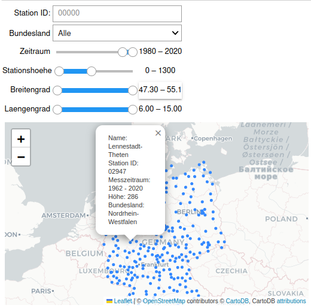
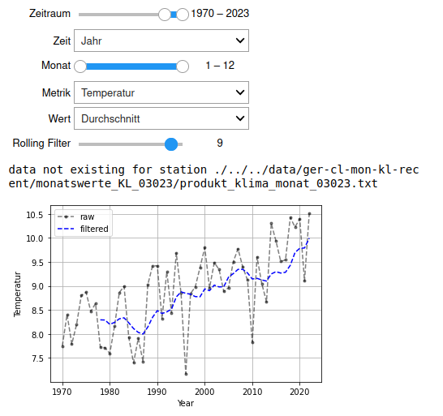

# DWD Station Data Visualization
With this Jupyter Notebook and the connected scripts data from the Deutscher Wetterdienst (DWD) stations can be visualized. It combines historical and recent data from the available stations from opendata.dwd (https://opendata.dwd.de/climate_environment/CDC/observations_germany/climate/monthly/kl/). 

You can not only visualize and filter the locations of the weather stations in germany.



Also it is possible to calculate averages for Temperature, Rain, ... for the visualized weather stations in the pic above:



Don't let the code in the Notebook disturb you. The main thing are the two interactive plots.

## Prerequisites
Before you begin, ensure you have met the following requirements:    
- Your machine can execute bash scripts (e.g. most Unix-Systems) 
- Your machine has python3 and jupyter.

First install the requirements for the code (virtual environment might also be a good idea):
```
git clone https://github.com/csRon/dwd_station_vis.git
cd dwd_station_vis
pip install -r requirements.txt
```

## Quick start
The data needs to be downloaded from the DWD opendata, unzipped and renamed. It will take some time (few minutes maybe) and will consume ~300 MB of storage. The data will be stored in a data folder. Just execute the following script:
```bash
bash download.sh
```
Then everything should be set up to start your jupyter notebook:
```
jupyter-notebook dwd_station_vis.ipynb
```

## Background
This project was programmed out of curiosity and to verify media headlines with clear data (most of the headlines can be verified, not all of them). It is quite some years old but I had no time to publish, so please forgive partially bad coding.

Please let me know if there is a nice API for such comprehensive weather data. This would make things a lot easier.

## License
DWD_Station_Vis is licensed under the MIT license.
    